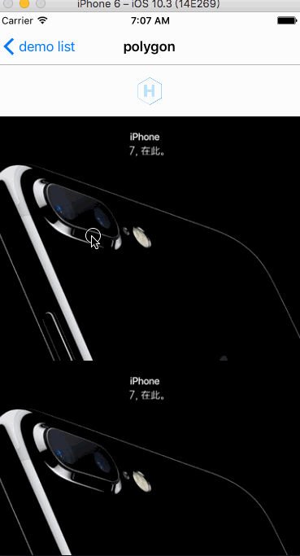

# SJLineRefresh

***




- **what's this?**
***
A easy customizable shape pull-to-refresh control


- how to use
***
```
let aPath = Bundle.main.path(forResource: "HHMedic", ofType: "plist")!
let aConfig = SJRefreshConfig(plist: aPath)
tableView.sj_header = SJRefreshView(config: aConfig) { [weak self] in
  //  Network connect
}

```


- Installation
***
**CocoaPods**

[CocoaPods](http://cocoapods.org/) is a dependency manager for Cocoa projects. You can install it with the following command:
```
$ gem install cocoapods
```

To integrate Alamofire into your Xcode project using CocoaPods, specify it in your Podfile
:
```
source 'https://github.com/CocoaPods/Specs.git'
platform :ios, '10.0'
use_frameworks!
target '<Your Target Name>' do
   pod 'SJLineRefresh', '~> 4.4'
end
```
Then, run the following command:
```
$ pod install
```

**Carthage**

[Carthage](https://github.com/Carthage/Carthage) is a decentralized dependency manager that builds your dependencies and provides you with binary frameworks.
You can install Carthage with [Homebrew](http://brew.sh/) using the following command:
```
$ brew update
$ brew install carthage
```
To integrate Alamofire into your Xcode project using Carthage, specify it in your Cartfile :
```
github "515783034/SJLIineRefresh" ~> 4.4
```
Run carthage update to build the framework and drag the built SJLineRefresh.framework into your Xcode project.


